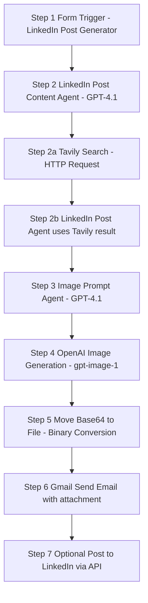

# 🚀 LinkedIn Post Image Prompt Generation

   

> **Single-file README (copy-paste ready)** — this file contains the full project description, all node-by-node settings (with system prompts included *inside* their respective steps), the mermaid workflow diagram, wireframe, sample inputs/outputs, download links, and import instructions.  
> I used the formatting style you provided as an example (badges, emojis, numbered steps, inline system prompts). Nothing from your project has been omitted.

---

## 📖 Project Overview
An n8n automation that transforms a user form submission into:
1. a **researched, professional LinkedIn post** (GPT-4.1 + Tavily web search for up-to-date information),  
2. an **image generation prompt** for a polished marketing graphic,  
3. a generated image via **OpenAI (gpt-image-1)**, and  
4. delivery of the post + image via **Gmail** (or optionally post to LinkedIn).

## Flow:  
Form → LinkedIn Post Content Agent (Tavily research) → Image Prompt Agent → OpenAI Image Generation → Convert Base64 → Send via Gmail / (Optional) Post to LinkedIn  


---

## ✨ Key Benefits
- ⏱️ **Fast**: create a researched post + visual in minutes  
- 📈 **Higher engagement**: research-backed text, hook, hashtags, CTA  
- 🎨 **Visual-first**: marketing style image prompt generation for LinkedIn visuals  
- 🔁 **Reusable & adaptable**: easily tweak for other social networks or templates  
- 🔐 **Controlled output**: "Require Specific Output Format" enabled in AI nodes (only final text or image prompt — no extra commentary)

---

## 🔒 Project Rule (Important)
> **Before providing any AI-generated output to an end-user, the agent MUST ask the user how the _tone_ and _format_ should be.**  
(This is a project rule preserved so every generated LinkedIn post meets the user’s preferred tone/format.)

---

## 🖼 Visual Workflow (Mermaid)


---

## ⚙️ Node-by-node n8n Setup (detailed & numbered)
---

### 🔢 Step 1 — Form Trigger (Webhook / Form Node)

- **Name**: Step 1 — Form Trigger  
- **Node Type**: Webhook / Form  
- **Form Title**: `Linked In Post Generator`  
- **Form URL**:  
- **Authentication**: None  

**Form Elements**:
- 📧 **Email** — type: *Email*, placeholder: `name@example.com`, **required**  
- 📝 **Topic of Post** — type: *Text*, placeholder: `Robots`, **required**  
- 🎯 **Target Audience** — type: *Text*, placeholder: `Required Field`, **required**  

- **Respond When**: Form Is Submitted  

---

### 🔢 Step 2 — LinkedIn Post Content Generation Agent (AI node)

- **Node Type**: OpenAI GPT-4.1  
- **Input Mapping**:  
  ```text
  Topic of Post: {{ $json['Topic of Post'] }}
  Target Audience: {{ $json['Target Audience'] }}

- **Require Specific Output Format**: ✅ Enabled  
- **Enable Fallback Model**: ✅ Enabled  
- **System Message**:  
```text
## Overview
You are an AI agent specialized in creating professional, educational, and engaging LinkedIn posts based on any topic provided by the user.

## Objectives:
Always begin by conducting a real-time search using the Tavily tool to gather the most accurate, up-to-date information on the topic. The post should be written to appeal to the provided target audience.

Based on your research, generate a well-structured LinkedIn post that:
- Starts with an engaging hook
- Professional in tone
- Clear and easy to read
- Educational and insightful
- Light on emojis (use only when highly relevant and minimal)
- Includes proper source attribution (e.g., “according to [source]”)
- Contains relevant hashtags to improve visibility
- Ends with a clear call to action (e.g., asking for thoughts, feedback, or shares)

## Output Instructions:
- Your ONLY output should be the final LinkedIn post text.
- Do not include explanations, notes, or anything beyond the post itself.
```

### 🔢 Step 2a — Tavily (HTTP Request)

- **Node Type**: HTTP Request  
- **Method**: POST  
- **URL**: `https://api.tavily.com/search`  

**Headers**:  
- `Content-Type: application/json`  
- `Authorization: Bearer <TAVILY_API_KEY>`  

**Body**:  
```
{
  "query": "{searchTerm}",
  "topic": "general",
  "search_depth": "advanced",
  "chunks_per_source": 3,
  "max_results": 1,
  "time_range": null,
  "days": 7,
  "include_answer": true,
  "include_raw_content": false,
  "include_images": false,
  "include_image_descriptions": false,
  "include_domains": [],
  "exclude_domains": []
}
```
- Replace `{searchTerm}` with `{{ $json["Topic of Post"] }}`  

---

### 🔢 Step 3 — Image Prompt Agent

- **Node Type**: OpenAI GPT-4.1  
- **Input**:  
  ```text
  LinkedIn Post: {{ $('Linkedin Post Agent').item.json.output }}

- **System Message**:  
```text
# Overview
You are an AI agent that transforms LinkedIn posts into visual prompt descriptions for generating graphic marketing materials. These visuals are designed to be paired with the post on LinkedIn, helping communicate the message in a visually engaging, brand-aligned way.

## Objective:
- Read and analyze the given LinkedIn post.
- Identify the main message, insight, or takeaway from the post.
- Create a clear and compelling graphic prompt that can be used with a text-to-image generator.
- The result should be a marketing-style graphic — not a literal scene or hyperrealistic photo — that:
  1) Visually supports or illustrates the key idea of the post
  2) Looks appropriate for use in a professional LinkedIn feed
  3) Feels polished, modern, and engaging

## Output Instructions:
- Output only the final image prompt. Do not output quotation marks.
- Do not repeat or rephrase the LinkedIn post.
- Do not add any explanations or extra content — just the image prompt.
```

### 🔢 Step 4 — OpenAI Image Generation (HTTP Request)

- **Node Type**: HTTP Request  
- **Method**: POST  
- **URL**: `https://api.openai.com/v1/images/generations`  

**Headers**:  
- `Content-Type: application/json`  
- `Authorization: Bearer <OPENAI_API_KEY>`  

**Body**:  
```json
{
  "model": "gpt-image-1",
  "prompt": "{{ $('Image Prompt Agent').item.json.output }}",
  "size": "1024x1024"
}
```

### 🔢 Step 5 — Convert Base64 → File

- **Node Type**: MoveBinaryData  
- **Operation**: `moveBase64ToFile`  
- **Base64 Input Field**: `data[0].b64_json`  
- **Output Binary Field**: `data`  
- **File Name**: `linkedin_post_image.png`  

---

### 🔢 Step 6 — Gmail (Send Email)

- **Node Type**: Gmail  
- **Resource**: Message  
- **Operation**: Send  
- **To**: `sachinsavkare08@gmail.com`  
- **Subject**: `Your LinkedIn Post is Here!`  

**Message**:  
```
Here you go Sachin!

{{ $('Linkedin Post Agent').item.json.output }}
```
- **Attachment**: `data`  

---

### 🔢 Step 7 — (Optional) Post on LinkedIn

- Use LinkedIn API (requires OAuth + `w_member_social` permission).  

---

## ✅ Example Inputs & Outputs

**Form Input**:  
- Email: `sachin@example.com`  
- Topic: `Morning vs Night People`  
- Audience: `Working Adults`  

**LinkedIn Post (example output)**:  
> Are you a "morning lark" or a "night owl"? …  

**Image Prompt (example output)**:  
A modern marketing graphic with split-screen…


---

## 📂 Free Template

- **Download**: [LinkedIn Post Agent Image Prompt Generation Template](https://github.com/SachinSavkare/LinkedIn-Post-Agent-Image-Prompt-Generation-n8n/blob/main/4.%20Linked%20In%20Post%20Agnt%20Image%20Prompt%20Generation.json)  

---

## 👨‍💻 Author

**Sachin Savkare** — 📧 `sachinsavkare08@gmail.com`  


